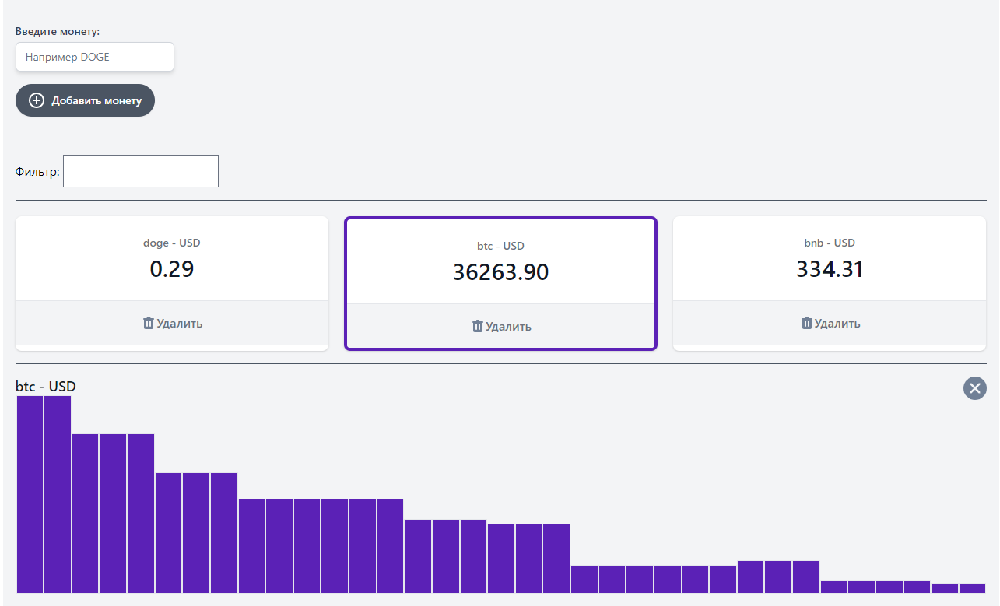

# vue-blockchain


## Project setup
```
yarn install
```

### Compiles and hot-reloads for development
```
yarn serve
```

### Compiles and minifies for production
```
yarn build
```

### Lints and fixes files
```
yarn lint
```

### TODO LIST
- Create autocomplete with coins name
- If ticker already created, then don't need to create

